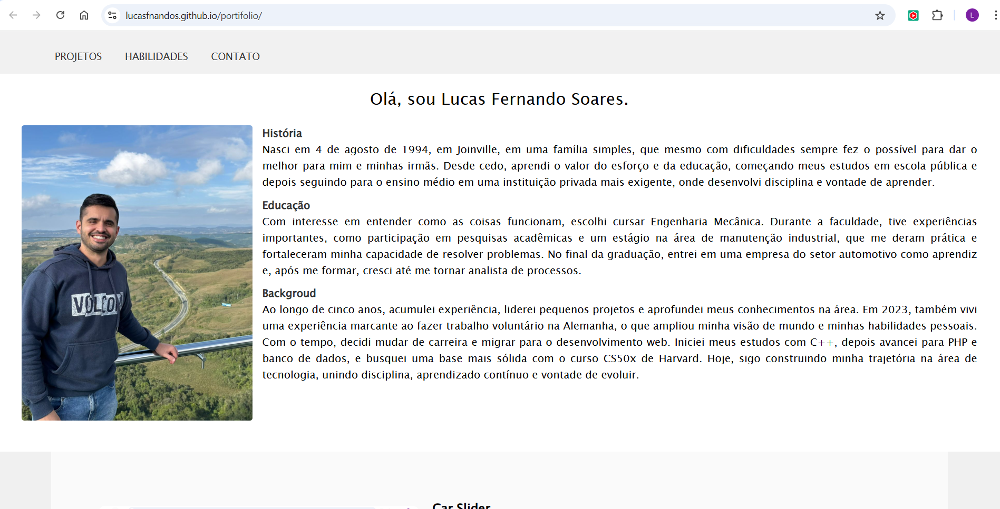
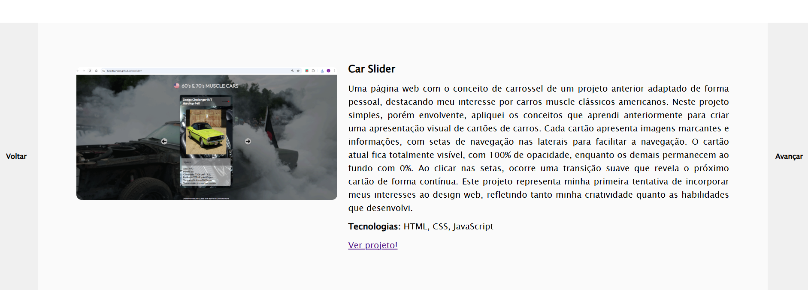
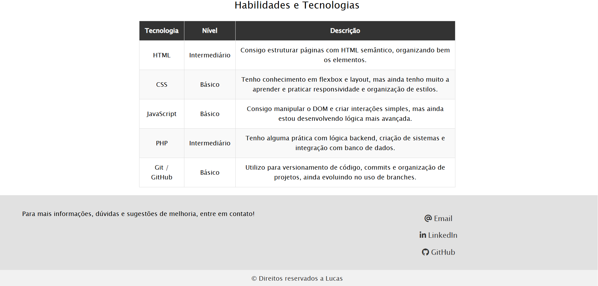

# Landing page portifolio

Este portifolio em forma de web page trás informações sobre a minha história, educação e outras experiências pessoais. Também é apresentado de forma resumida os projetos que desenvolvi desde o momento que entrei em contato com o mundo da programação. Além disso, apresento de forma honesta minhas habilidades nas principais tecnologias de desenvolvimento web, HTML, CSS, JavaScript, PHP e Git.

## Objetivo
Mais do que criar uma página para mostrar os projetos desenvolvidos, esta landing page tem como principal objetivo trazer a evolução do meu desempenho. Essa proposta visa evidenciar o constante aprimoramento nas tecnologias aplicadas bem como aplicar novas tecnologias na medida que o conhecimento será adquirido, usando a prática como meio de aprendizagem, exatamente como o mercado e o mundo exigem.

## Funcionalidades
No portifolio os projetos são apresentados na seção projetos, que pode ser acessado através do link na barra superior ou scrolando a tela logo abaixo da seção sobre mim. Um card que ocupa a largura da tela trás, em forma de carrosel, as informações sobre o porjeto e nas laterais esquerda e direita os botões para navegação entre os projetos. Alem disso, é possível acessar os projetos, que estão hospedados na plataforma github, através do link "Ver projeto!".
Com o conceito de âncora em HTML os demais links de Habilidades e Contato levam os usuários às respectivas seções para mais informações.
Embora simples, o layout da landing page foi construido pensado para diferentes tamanhos de tela, trazendo o conceito de responsividade, dessa forma, para que tantos usuários de desktop quanto de smartphones possam ter uma melhor experiência. Essa funcionalidade também foi desenvolvida com manipulação do DOM no JavaScript e com o @media query no CSS, que possibilita entender qual o tamanho de tela o conteúdo está sendo exibido e manipula classes do HTMl e propriedades do CSS para mosrar o conteúdo adatado para cada situação.

## Tecnologias
- HTML
- CSS
- JavaScript

## Estrutura
    portfolio/
    │
    ├── index.html
    ├── README.md
    │
    ├── source/
       ├── css/
       │   └── style.css
       └── fontawesome/        
       │
       ├── js/
       │   └── script.js
       │
       └── images/
    
    
## Conceitos (por baixo dos panos)
Entendendo a importância desse portifólio também para fins acadêmicos neste tópico explico os conceitos utilizados que são comumente referido no mundo da programação como o funcionamento "por baixo dos panos".

#### HTML
No HTML foram aplicados conceitos fundamentais para estruturação e organização da página. O uso de meta tags, como charset="UTF-8" e viewport, garante a correta interpretação dos caracteres e a adaptação do layout em diferentes dispositivos. Também foi considerada a meta tag description, importante para SEO (Search Engine Optimization), pois define um resumo da página que pode ser exibido nos resultados de busca, contribuindo para melhorar a taxa de cliques e a apresentação do conteúdo ao usuário.
A estrutura foi construída utilizando HTML semântico, com elementos como header, section e footer, o que melhora a legibilidade do código, facilita a manutenção e contribui para uma melhor indexação por mecanismos de busca. Além disso, foram utilizadas classes e IDs para organizar e identificar elementos, permitindo maior controle na estilização e manipulação via CSS e JavaScript. Por fim, foi aplicado o conceito de âncoras com #, possibilitando navegação interna entre as seções da página de forma simples e eficiente.

#### CSS
No CSS, o foco foi construir um layout funcional e adaptável. Foi utilizado o display: flex em partes específicas da aplicação para controlar o alinhamento e distribuição dos elementos, principalmente na seção de projetos, onde há necessidade de organizar conteúdo de forma dinâmica. A responsividade foi implementada com o uso de media queries, considerando três faixas principais de tela, permitindo ajustar o layout, tamanhos e organização conforme o dispositivo. Outro conceito aplicado foi a utilização de layouts diferentes com display: none, onde versões distintas de navegação (desktop e mobile) são alternadas de acordo com o tamanho da tela. Isso permite entregar uma experiência mais adequada ao usuário, exibindo apenas os elementos necessários em cada contexto de tela.

#### JAVASCRIPT
No JavaScript, foram aplicados conceitos voltados à organização de dados e manipulação da interface. Foi criada uma lista (array) de objetos para armazenar as informações dos projetos, como nome, descrição, tecnologias e links. Isso facilita a manutenção e expansão do conteúdo, já que novos projetos podem ser adicionados diretamente na estrutura de dados. Para percorrer essa lista, foi utilizado o método forEach, permitindo iterar sobre os elementos e acessar suas informações de forma prática. Também foi feita manipulação do DOM, incluindo a criação dinâmica de elementos HTML com createElement e inserção de conteúdo com innerHTML. Além disso, foi utilizado o controle de classes com métodos como classList.add, remove e toggle, permitindo alterar o estado visual dos elementos, como no carrossel de projetos e no menu mobile, tornando a página mais interativa sem necessidade de recarregamento.

## Autor
Lucas Fernando Soares
🔗 [LinkedIn](https://www.linkedin.com/in/lucasfsoares)